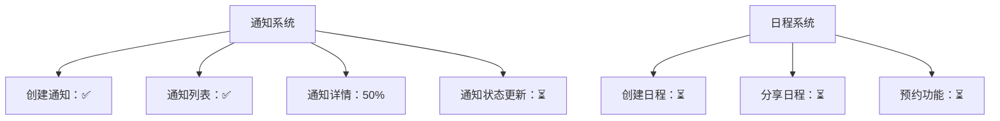

promotion

现在考虑马上达到对话长度上限，请生成一段包含所有关键结果的‘对话接力提示词’，我将粘贴到新窗口


## 项目结构规划

```
├── client/              # 小程序前端
│   ├── pages/           # 页面目录
│   │   ├── schedule/    # 日程管理页
│   │   ├── booking/     # 预约页
│   │   └── profile/     # 个人中心页
│   ├── utils/           # 工具函数
│   ├── app.js           # 小程序入口
│   ├── app.json         # 全局配置
│   └── app.wxss         # 全局样式
│
├── server/              # Node.js后端
│   ├── controllers/     # 控制器
│   ├── models/          # 数据模型
│   ├── routes/          # 路由
│   ├── config/          # 配置文件
│   ├── app.js           # 主入口
│   └── package.json
│
└── README.md            # 项目说明
```


## 新增图片资源

需要添加以下图片资源到/images目录：

text

```
arrow-left.png       左箭头图标
arrow-right.png      右箭头图标
calendar-empty.png   空状态日历图标
location.png         位置图标
participants.png     参与者图标
edit.png             编辑图标
delete.png           删除图标
add-white.png        白色添加图标
calendar-icon.png   # 日历图标
```


```
user-icon.png        # 用户图标
location-icon.png    # 地点图标
contact-icon.png     # 联系图标
edit-icon.png        # 编辑图标
cancel-icon.png      # 取消图标
no-tasks.png         # 空状态图标
```


### 小程序页面设计

底部导航栏：首页，探索，我的

- 我的profile

  - 名片介绍
    - 名片public和private设置
  - 日期表
    - 针对每一个日期可以点击进入详情页面进行添加预约行程安排，向前的查询，以及向后一年之内的行程安排
    - 详情页面添加预约行程安排的设计，能进行自定义行程，复制行程
    - 行程预约详情涉及
      - 具体日期
      - 具体时间段
      - 行程名称
      - 预约人
      - 地点
      - 联系方式
  - 即将进行的任务
    - 可以点击进入行程详情页面

- 探索explore页面

  - 他人发起的预约请求确认，以及我发出的预约请求获得对方同意或者拒绝的反馈确认

  - 他人分享的日程，当有人分享日程链接给你时，点开链接为explore.wxml的页面，并在第二个区域显示为对方的日历表；如果我从来没有点开过其他人分享的链接，则显示“无分享预约”，否则则显示上一次点开的日程链接

    - 日历表形式应该与profile.wxml中的一致，如下

    - ```wxml
      <!-- 日历容器（统一网格布局） -->
      <view class="calendar-container">
          <!-- 星期标题（使用网格布局） -->
          <view class="week-header">
            <view wx:for="{{weekDays}}" wx:key="index" class="week-day">
              {{item}}
            </view>
          </view>
          
          <!-- 日历区域（使用网格布局） -->
          <view class="calendar-grid">
            <view wx:for="{{calendarDays}}" wx:key="index" class="calendar-cell {{item.isToday ? 'today' : ''}} {{item.isSelected ? 'selected' : ''}} {{item.hasEvent ? 'has-event' : ''}} {{item.isCurrentMonth ? '' : 'other-month'}}"
                  bindtap="selectDate" data-date="{{item.date}}">
              <text class="day-number">{{item.day}}</text>
              <view wx:if="{{item.hasEvent}}" class="event-indicator"></view>
            </view>
          </view>
        </view>
      
        <!-- 查看当日详情按钮 -->
        <view class="view-detail-btn">
        <view class="detail-btn" bindtap="viewDayDetail">
          <view class="btn-content">
            <text class="date-text">{{formattedSelectedDate}}</text>
            <text class="btn-text">详情</text>
          </view>
        </view>
      </view>
      ```

  - 分享我的日程

    - 对方在点击我的分享链接以后，会自动打开该小程序，以及进入explore.wxml页面，页面会获取我的日程信息然后显示在第二个模块中，我可以在第二个模块中点击时间和对方进行事件预约
    - goto:技术实现要点

- 首页

  - 发现各行业散人或者精英的名片及日程


#### 技术实现要点

1. **分享链接生成**：

   javascript

   ```
   generateShareLink() {
     const userId = getApp().globalData.userId;
     const shareLink = `https://yourschedule.com/share/${userId}`;
     this.setData({ shareLink });
   }
   ```

2. **二维码生成**（云函数实现）：

   javascript

   ```
   // 云函数 generateQRCode
   const cloud = require('wx-server-sdk')
   cloud.init()
   
   exports.main = async (event) => {
     const wxacode = await cloud.openapi.wxacode.get({
       path: `pages/explore/explore?scheduleId=${event.userId}`,
       width: 430
     })
     
     // 上传到云存储
     const upload = await cloud.uploadFile({
       cloudPath: `qrcodes/${Date.now()}.png`,
       fileContent: wxacode.buffer
     })
     
     return { fileID: upload.fileID }
   }
   ```

3. **分享处理逻辑**：

   javascript

   ```
   onShareAppMessage() {
     return {
       title: '我的可预约时间',
       path: `/pages/explore/explore?shareId=${getApp().globalData.userId}`,
       imageUrl: '/images/share-thumb.png'
     };
   }
   ```


很好，现在已经完成了profile和explore页面的设计，可能还有一些遗漏，留到后面进行修补，

现在考虑马上达到对话长度上限，请生成一段包含所有关键结果的‘对话接力提示词’，我将粘贴到新窗口


```
主页面
	- 探索
		1. 通知详情页和历史页的完整实现
 		2. 共享日程详情页的预约功能
 		3. 云函数对接（通知推送/日程获取）
 		4. 真机测试与样式微调
 		5. 性能优化（日历渲染效率）
	- 我的
```


### 五、真机测试清单

| 测试模块 | 测试要点       | 预期结果               |
| :------- | :------------- | :--------------------- |
| 通知系统 | 滑动操作流畅性 | 无卡顿，响应时间<200ms |
|          | 推送到达率     | 微信服务通知即时接收   |
| 共享日历 | 跨月加载性能   | 月份切换<1秒           |
|          | 深色模式适配   | 所有元素可见性良好     |
| 预约流程 | 表单验证机制   | 阻止无效提交           |
|          | 网络中断恢复   | 数据自动重传           |

### 六、待办事项优先级

1. ⭐⭐⭐ 云函数与前端数据联调
2. ⭐⭐ 预约冲突检测逻辑（同一时段重复预约）
3. ⭐ 通知红点计数优化
4. ⭐ 日程分享链接失效机制（7天自动过期）

建议下一步：

1. 先实现云函数基础框架
2. 完成通知详情页的状态流转测试
3. 优化日历组件的内存管理
4. 添加预约前的身份验证步骤

需要我提供具体组件的实现代码或云函数完整示例，请随时告知具体模块名称。


## 整体实施步骤

### 第一步：数据库设计与初始化

1. 创建数据库集合
2. 设计数据结构
3. 初始化测试数据

### 第二步：云函数开发

1. 创建核心云函数
2. 实现业务逻辑
3. 本地测试与调试

### 第三步：前端服务层集成

1. 创建服务层封装
2. 实现API调用
3. 错误处理与状态管理

### 第四步：部署与上线

1. 云环境配置
2. 云函数部署
3. 小程序提审与发布


### 后端部署


  A[微信云开发基础] --> B[云函数入门]
  B --> C[数据库操作]
  C --> D[文件存储]
  D --> E[用户身份认证]
  E --> F[部署与监控]


- 开发部署流程

​    A[需求分析] --> B[数据库设计]
​    B --> C[云函数开发]
​    C --> D[本地测试]
​    D --> E[部署到云环境]
​    E --> F[前端集成]
​    F --> G[全面测试]
​    G --> H[提交审核]
​    H --> I[发布上线]


## 第一步：数据库设计与初始化

#### 步骤1: 数据库设计（基于你的数据结构）

**notifications 集合结构**

```javascript
{
  _id: 'n123', // 自动生成ID
  type: 'incoming', // 通知类型
  title: '新预约请求',
  message: '详细描述...',
  time: new Date(), // 时间戳
  status: 'unread', // 状态
  details: {
    date: '2023-12-05',
    timeSlot: '14:00-15:00',
    purpose: '项目会议'
  },
  senderId: 'u123', // 发送者ID
  receiverId: 'u456', // 接收者ID
  createTime: new Date() // 创建时间
}
```

**schedules 集合结构**

```javascript
{
  _id: 's123', // 自动生成ID
  userId: 'u123456',
  name: '姓名',
  title: '头衔',
  avatar: 'cloud://your-env-id/images/avatar.png',
  eventDates: ['2023-12-05', '2023-12-07'],
  shareToken: 'abcdef123456', // 分享令牌
  expireTime: new Date('2023-12-31') // 分享过期时间
}
```


# 第二步：云函数开发


# 小程序测试进度回顾与继续测试方案

几天没操作了，我来帮您回忆之前的测试进度并规划下一步的测试计划：

## 测试进度回顾

### 已完成工作
1. **数据库设计**：
   - 创建了 `notifications` 和 `schedules` 集合
   - 设计了通知和日程的数据结构

2. **云函数开发**：
   - `notification-service`：通知服务（创建、更新、获取通知）
   - `schedule-service`：日程服务（保存、获取、分享日程）
   - `login`：用户登录服务（获取用户信息）

3. **前端集成**：
   - 创建了服务层封装（`notification.js`, `schedule.js`）
   - 实现了通知详情页和通知历史页

4. **测试进展**：
   - 修复了通知列表查询问题（用户ID匹配问题）
   - 解决了云函数调用错误（`FUNCTION_NOT_FOUND`）
   - 修复了 `wxContext is not defined` 错误
   - 完成了通知创建和通知列表获取的基础测试

### 当前状态


## 下一步测试计划

### 1. 通知系统剩余功能测试

#### 测试用例：通知状态更新
```javascript
async function testNotificationUpdate() {
  console.group('📝 通知状态更新测试');
  let notificationId = null;

  try {
    // 1. 创建测试通知
    const createRes = await wx.cloud.callFunction({
      name: 'notification-service',
      data: {
        action: 'create',
        data: {
          receiverId: 'test_user_1',
          title: '状态更新测试通知',
          message: '测试通知状态更新功能',
          type: 'incoming',
          status: 'unread'
        }
      }
    });
    
    // 修正ID获取方式（确保正确获取文档ID）
    notificationId = createRes.result?.data?._id || createRes.result?.data?.id;
    if (!notificationId) throw new Error('无法获取通知ID');
    console.log('测试通知创建成功, ID:', notificationId);
    
    // 2. 更新通知状态
    const updateRes = await wx.cloud.callFunction({
      name: 'notification-service',
      data: {
        action: 'update',
        data: {
          id: notificationId,
          status: 'read',
          type: 'confirmed'
        }
      }
    });
    
    // 添加更新结果验证
    if (updateRes.result.code !== 200) {
      throw new Error(`更新失败: ${updateRes.result.message}`);
    }
    console.log('更新结果:', updateRes.result);
    
    // 3. 验证更新结果（添加3秒延迟确保数据同步）
    await new Promise(resolve => setTimeout(resolve, 3000));
    
    const getRes = await wx.cloud.callFunction({
      name: 'notification-service',
      data: {
        action: 'get',
        data: { id: notificationId }
      }
    });
    
    const notification = getRes.result.data;
    console.log('当前通知状态:', notification);
    
    if (notification.status === 'read' && notification.type === 'confirmed') {
      console.log('✅ 状态更新测试通过');
    } else {
      console.error('❌ 状态更新测试失败');
      console.table({
        expected: { status: 'read', type: 'confirmed' },
        actual: { status: notification.status, type: notification.type }
      });
    }
    
  } catch (error) {
    console.error('测试失败:', error);
  } finally {
    // 4. 使用云函数清理测试数据
    if (notificationId) {
      console.log('开始清理测试数据...');
      const cleanRes = await wx.cloud.callFunction({
        name: 'test-cleanup',  // 使用新创建的清理云函数
        data: { 
          collection: 'notifications',
          id: notificationId
        }
      });
      
      if (cleanRes.result.code === 200) {
        console.log('✅ 测试数据清理成功');
      } else {
        console.error('❌ 数据清理失败:', cleanRes.result.message);
      }
    }
    console.groupEnd();
  }
}

// 执行测试
testNotificationUpdate();
```

### 2. 日程系统功能测试

#### 测试用例：创建和获取日程
```javascript
async function testScheduleOperations() {
  console.group('📅 日程系统测试');
  
  try {
    // 1. 创建测试日程
    const createRes = await wx.cloud.callFunction({
      name: 'schedule-service',
      data: {
        action: 'save',
        data: {
          eventDates: ['2023-12-15', '2023-12-16'],
          name: '测试用户',
          title: '测试职位'
        }
      }
    });
    console.log('日程创建结果:', createRes.result);
    
    // 2. 获取用户日程
    const userRes = await wx.cloud.callFunction({
      name: 'schedule-service',
      data: {
        action: 'getByUser',
        data: { userId: 'test_user_1' }
      }
    });
    
    if (userRes.result.data && userRes.result.data.eventDates) {
      console.log('✅ 获取用户日程成功');
      console.log('日程日期:', userRes.result.data.eventDates);
    } else {
      console.error('❌ 获取用户日程失败');
    }
    
    // 3. 生成分享令牌
    const tokenRes = await wx.cloud.callFunction({
      name: 'schedule-service',
      data: {
        action: 'generateToken'
      }
    });
    
    if (tokenRes.result.data && tokenRes.result.data.token) {
      console.log('✅ 生成分享令牌成功');
      const shareToken = tokenRes.result.data.token;
      
      // 4. 通过令牌获取日程
      const shareRes = await wx.cloud.callFunction({
        name: 'schedule-service',
        data: {
          action: 'getByToken',
          data: { token: shareToken }
        }
      });
      
      if (shareRes.result.data) {
        console.log('✅ 通过令牌获取日程成功');
      } else {
        console.error('❌ 通过令牌获取日程失败');
      }
    } else {
      console.error('❌ 生成分享令牌失败');
    }
    
  } catch (error) {
    console.error('测试失败:', error);
  }
  
  console.groupEnd();
}

// 执行测试
testScheduleOperations();
```

### 3. 端到端流程测试

#### 完整预约流程测试
```javascript
async function testFullBookingFlow() {
  console.group('🔁 端到端预约流程测试');
  
  try {
    // 1. 用户A创建日程
    console.log('用户A创建日程...');
    const scheduleRes = await wx.cloud.callFunction({
      name: 'schedule-service',
      data: {
        action: 'save',
        data: {
          eventDates: ['2023-12-10', '2023-12-11', '2023-12-12'],
          name: '用户A',
          title: '项目经理'
        }
      }
    });
    
    // 2. 用户A生成分享链接
    console.log('用户A生成分享令牌...');
    const tokenRes = await wx.cloud.callFunction({
      name: 'schedule-service',
      data: { action: 'generateToken' }
    });
    const shareToken = tokenRes.result.data.token;
    
    // 3. 用户B通过链接查看日程
    console.log('用户B查看共享日程...');
    const shareRes = await wx.cloud.callFunction({
      name: 'schedule-service',
      data: {
        action: 'getByToken',
        data: { token: shareToken }
      }
    });
    
    // 4. 用户B发送预约请求
    console.log('用户B发送预约请求...');
    const bookingRes = await wx.cloud.callFunction({
      name: 'notification-service',
      data: {
        action: 'create',
        data: {
          receiverId: 'userA_id', // 实际应为用户A的ID
          title: '预约请求',
          message: '用户B请求预约您的时间',
          type: 'incoming',
          details: {
            date: '2023-12-11',
            timeSlot: '14:00-15:00',
            purpose: '项目讨论'
          }
        }
      }
    });
    const notificationId = bookingRes.result.data.id;
    
    // 5. 用户A处理请求
    console.log('用户A处理预约请求...');
    await wx.cloud.callFunction({
      name: 'notification-service',
      data: {
        action: 'update',
        data: {
          id: notificationId,
          status: 'read',
          type: 'confirmed'
        }
      }
    });
    
    // 6. 用户B确认结果
    console.log('用户B确认结果...');
    const resultRes = await wx.cloud.callFunction({
      name: 'notification-service',
      data: {
        action: 'get',
        data: { id: notificationId }
      }
    });
    
    if (resultRes.result.data.type === 'confirmed') {
      console.log('✅ 端到端流程测试通过');
    } else {
      console.error('❌ 端到端流程测试失败');
    }
    
  } catch (error) {
    console.error('测试失败:', error);
  }
  
  console.groupEnd();
}

// 执行测试
testFullBookingFlow();
```

## 测试环境准备

### 1. 数据库初始化脚本
在云开发控制台执行：
```javascript
// 清空测试数据
db.collection('notifications').where({}).remove();
db.collection('schedules').where({}).remove();

// 创建测试通知
db.collection('notifications').add({
  receiverId: 'test_user_1',
  title: '初始化通知',
  message: '这是初始化测试通知',
  type: 'incoming',
  status: 'unread',
  details: {
    date: '2023-12-10',
    timeSlot: '09:00-10:00',
    purpose: '测试会议'
  },
  createTime: new Date()
});

// 创建测试日程
db.collection('schedules').add({
  userId: 'test_user_1',
  name: '测试用户',
  title: '测试职位',
  eventDates: ['2023-12-10', '2023-12-15'],
  createTime: new Date()
});
```

### 2. 云函数部署状态检查
1. 打开微信开发者工具
2. 查看云函数状态（确保所有云函数都是绿色已部署状态）
3. 如果有未部署的云函数，右键点击选择"上传并部署"

### 3. 前端代码更新检查
1. 确保所有页面引用了最新的服务层代码
2. 验证 `app.js` 中的云环境配置正确
3. 检查所有页面使用了正确的用户ID（OpenID）

## 测试执行顺序建议

1. **基础功能测试**：
   - 通知创建 → 通知列表 → 通知状态更新
   - 日程创建 → 日程获取 → 日程分享

2. **集成测试**：
   - 通知详情页加载
   - 通知历史页筛选
   - 共享日程加载

3. **端到端测试**：
   - 完整预约流程
   - 冲突预约处理
   - 通知推送流程

4. **性能测试**：
   - 页面加载时间
   - 云函数响应时间
   - 大数据量测试

5. **安全测试**：
   - 权限验证
   - 数据隔离
   - 输入验证

## 测试结果记录表

| 测试模块 | 测试用例 | 状态 | 结果   | 备注 |
| -------- | -------- | ---- | ------ | ---- |
| 通知系统 | 创建通知 | ✅    | 成功   | -    |
| 通知系统 | 通知列表 | ✅    | 成功   | -    |
| 通知系统 | 状态更新 | ⏳    | 待测试 | -    |
| 日程系统 | 创建日程 | ⏳    | 待测试 | -    |
| 日程系统 | 分享日程 | ⏳    | 待测试 | -    |
| 预约流程 | 完整流程 | ⏳    | 待测试 | -    |

## 下一步行动建议

1. **执行通知状态更新测试**：
   - 使用 `testNotificationUpdate()` 脚本
   - 验证状态更新是否同步到数据库

2. **执行日程系统测试**：
   - 使用 `testScheduleOperations()` 脚本
   - 重点验证分享令牌功能

3. **执行端到端测试**：
   - 使用 `testFullBookingFlow()` 脚本
   - 模拟真实用户交互流程

4. **修复发现的问题**：
   - 记录测试中发现的问题
   - 优先解决阻塞性问题

5. **准备上线**：
   - 完成所有测试用例
   - 优化性能
   - 配置生产环境

请告诉我您想从哪个测试开始继续，或者需要我提供特定测试的详细指导。我们可以按照优先级逐步完成剩余测试任务。


